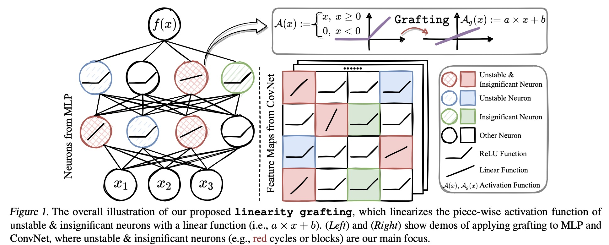

# Linearity Grafting: Relaxed Neuron Pruning Helps Certifiable Robustness

[](https://opensource.org/licenses/MIT)

Codes for this paper **Linearity Grafting: Relaxed Neuron Pruning Helps Certifiable Robustness** [ICML 2022]

Tianlong Chen\*, Huan Zhang\*, Zhenyu Zhang, Shiyu Chang, Sijia Liu, Pin-Yu Chen, Zhangyang Wang (\* Equal contribution)

## Overview:

Certifiable robustness is a highly desirable property for adopting deep neural networks (DNNs) in safety-critical scenarios, but often demands tedious computations to establish. The main hurdle lies in the massive amount of non-linearities in large DNNs. For ReLU networks under input perturbations, the ReLU neurons whose inputs may cross zero (referred to as “unstable” neurons) are often the key factor to determine the difficulty of certification. To trade off the DNN expressiveness (which calls for more non-linearities) and robustness certification scalability (which prefers more lineari- ties), we propose a novel solution to strategically manipulate neurons, by *“grafting”* appropriate levels of linearity. The core of our proposal is to first linearize insignificant and unstable ReLU neurons, to eliminate the non-linear components that are both redundant for DNN performance and harmful to its certification. We then optimize the associated slopes and intercepts of the replaced linear activations for restoring the performance while maintaining certifiability. Hence, typical neuron pruning could be viewed as a *special case* of grafting a linear function of the fixed zero slopes and intercept, that might overly restrict the network flexibility and sacrifice its performance.



## Prepare Environment:

```
cd main
conda env create -f environment.yml
conda activate alpha-beta-crown
pip install advertorch
```

## Run the demo:

```
cd main
# Train
bash script/train.sh # Pretrain a CNN-B on CIFAR-10 by Fast adversarial training with eps=2/255
bash script/train_graft.sh # Finetuning with 50% Grafting ratio mask

# Verify
bash script/verify.sh # verify with Beta-CROWN + branch and bounding on pretrained baseline model
bash script/verify_graft.sh # verify with Beta-CROWN + branch and bounding on Grafted model
```

```
# Verify with the pretrained model
bash script/verify_pretrained/baseline.sh
bash script/verify_pretrained/graft.sh
```

## Citation:

```
TBD
```

## Acknowledgement:

Code in the `main` folder is based on the [alpha,beta-CROWN verifier](https://github.com/huanzhang12/alpha-beta-CROWN) with customizations to support linearity grafting.

